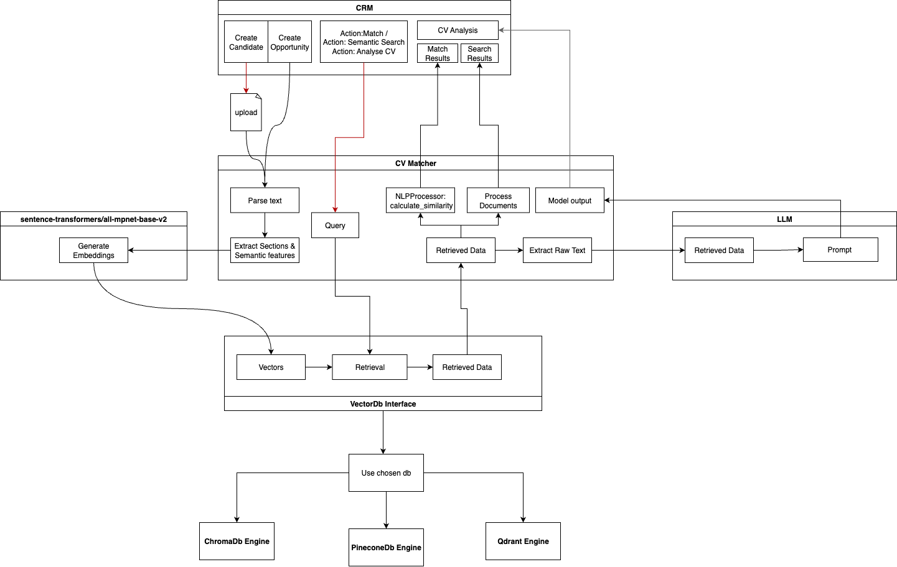
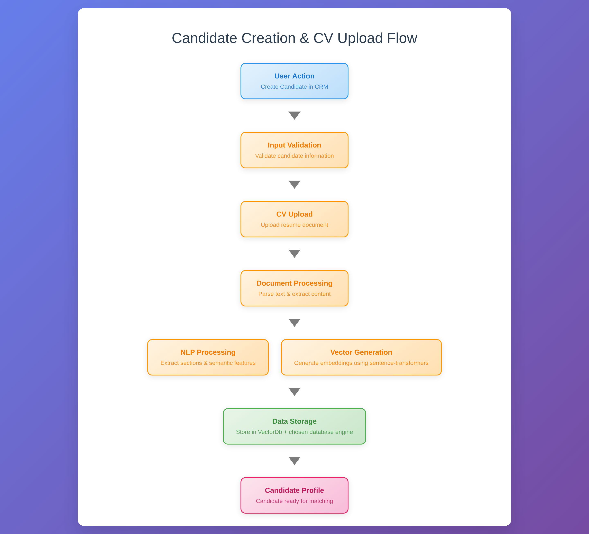
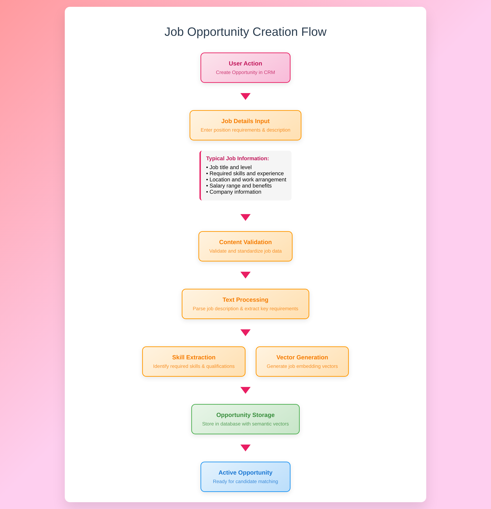
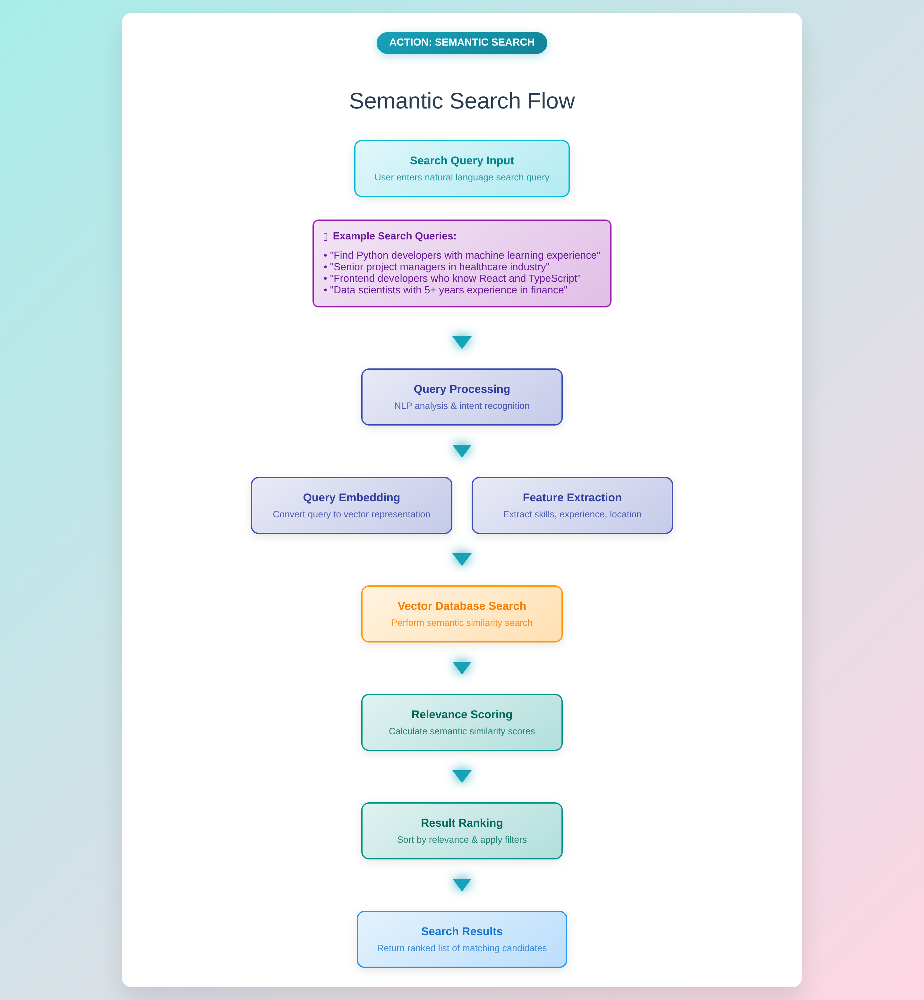
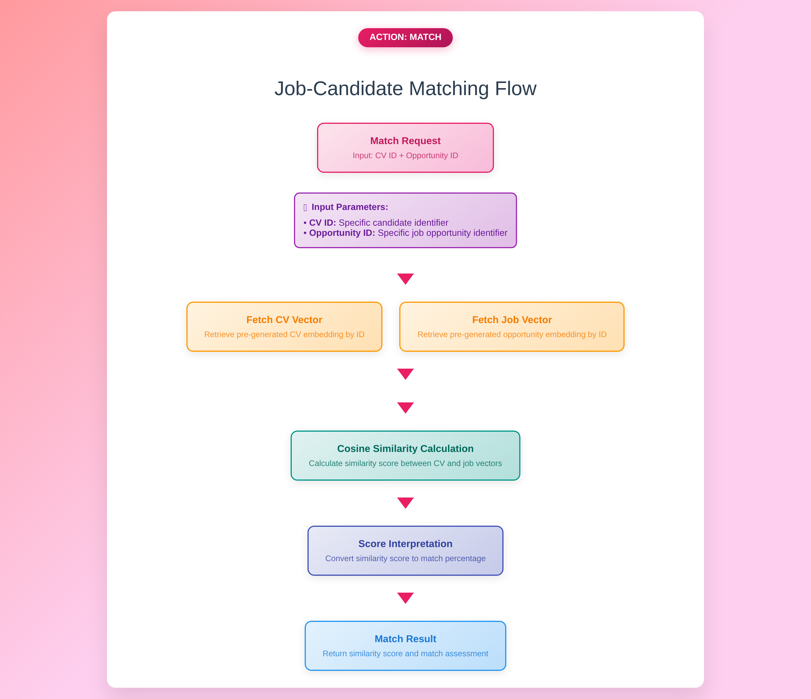
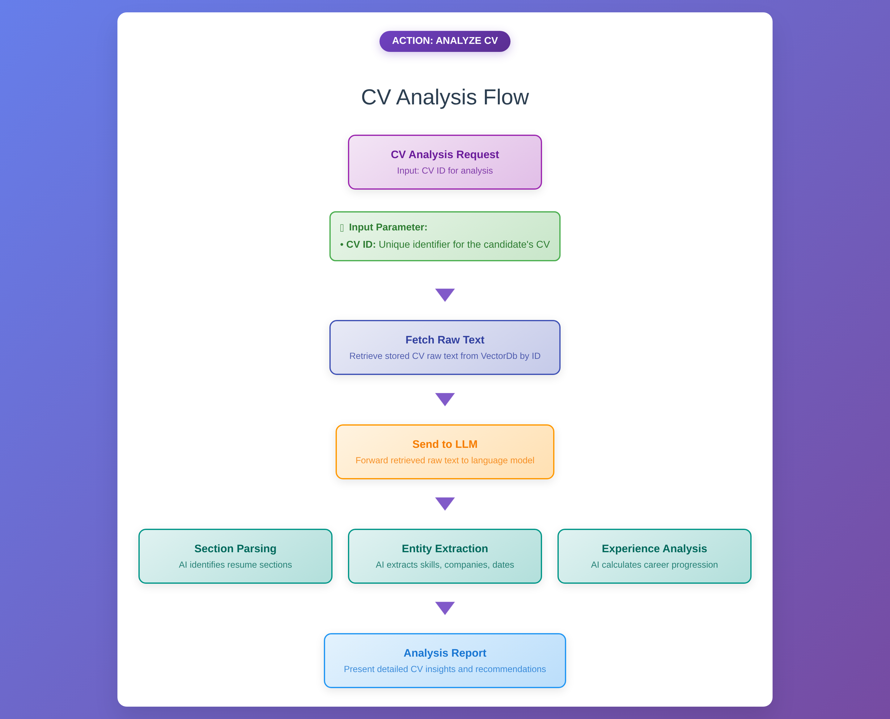

# CV-Matcher: Semantic CV-Job Matching System

A powerful semantic matching system that uses AI to match CVs with job opportunities based on meaning, not just keywords.


*Architectural diagram showing the complete CV-Matcher system flow from CRM interface through document processing, embedding generation, vector database storage, and LLM integration.*

## 🚀 Features

### Core Capabilities
- **Semantic Search**: Fast semantic search returning only document IDs for efficient processing
- **Multi-format Support**: Parse PDF, DOCX, and text documents
- **Vector Database**: Flexible backend with ChromaDB, Pinecone, and Qdrant support
- **NLP Processing**: Advanced text processing with sentence transformers
- **RESTful API**: Complete FastAPI-based API with automatic documentation

### Matching Features
- **CV-Job Matching**: Intelligent matching between CVs and job opportunities
- **Similarity Scoring**: Configurable thresholds for excellent, good, fair, and minimum matches
- **Batch Processing**: Efficient processing of multiple documents
- **Real-time Search**: Instant semantic search results

### Analysis Features
- **CV Analysis**: AI-powered CV analysis using Large Language Models for detailed insights
- **Skill Extraction**: Automatic extraction and categorization of skills from CVs
- **Experience Analysis**: Intelligent analysis of work experience and career progression
- **Recommendations**: AI-generated recommendations for CV improvement and job matching

## 🔄 System Workflows

### Candidate Creation Flow

*Complete workflow for creating and processing candidate CVs through the system, from upload to vector storage.*

### Opportunity Creation Flow

*Workflow for creating and processing job opportunities, including text extraction and semantic analysis.*

### Semantic Search Flow

*End-to-end semantic search process showing how queries are processed and matched against stored documents.*

### Match Action Flow

*Detailed matching workflow showing how CVs and opportunities are compared and scored for similarity.*

### CV Analysis Flow

*AI-powered CV analysis workflow using Large Language Models for detailed insights and recommendations.*

## 🛠️ Development Setup

### Prerequisites
- Python 3.11+
- pip
- Git

### Local Development

1. **Clone the repository:**
```bash
git clone <repository-url>
cd CV-Matcher
```

2. **Create virtual environment:**
```bash
python -m venv venv
source venv/bin/activate  # On Windows: venv\Scripts\activate
```

3. **Install dependencies:**
```bash
pip install -r requirements.txt
python -m spacy download en_core_web_sm
```

4. **Set up environment:**
```bash
cp env.example .env
# Edit .env with your configuration
```

5. **Run the application:**
```bash
python main.py
```

The API will be available at `http://localhost:8000`

## 🐳 Docker Setup

### Quick Start

1. **Build the image:**
```bash
docker build -t cv-matcher .
```

2. **Set up environment:**
```bash
cp env.example .env
# Edit .env with your configuration
```

3. **Run the container:**
```bash
docker run -d \
  --name cv-matcher-api \
  -p 8000:8000 \
  --env-file .env \
  -v $(pwd)/vector_db:/app/vector_db \
  -v $(pwd)/uploads:/app/uploads \
  -v $(pwd)/logs:/app/logs \
  --restart unless-stopped \
  cv-matcher
```

### Management Commands
```bash
# View logs
docker logs cv-matcher-api

# Stop container
docker stop cv-matcher-api

# Remove container
docker rm cv-matcher-api
```

## ⚙️ Environment Variables

### API Configuration
| Variable | Default | Description |
|----------|---------|-------------|
| `API_HOST` | `0.0.0.0` | API server host |
| `API_PORT` | `8000` | API server port |
| `API_DEBUG` | `true` | Enable debug mode |
| `API_WORKERS` | `1` | Number of worker processes |

### Vector Database
| Variable | Default | Description |
|----------|---------|-------------|
| `VECTOR_DB_TYPE` | `chromadb` | Vector database type |
| `CHROMADB_COLLECTION_NAME` | `cv_job_embeddings` | ChromaDB collection name |
| `CHROMADB_PERSIST_DIRECTORY` | `./vector_db` | ChromaDB persistence directory |

### Processing Configuration
| Variable | Default | Description |
|----------|---------|-------------|
| `BATCH_SIZE` | `32` | Batch size for processing |
| `MAX_TEXT_LENGTH` | `512` | Maximum text length |
| `CHUNK_SIZE` | `200` | Text chunk size |
| `CHUNK_OVERLAP` | `50` | Chunk overlap |
| `MAX_FILE_SIZE_MB` | `10` | Maximum file size |

### Matching Thresholds
| Variable | Default | Description |
|----------|---------|-------------|
| `EXCELLENT_MATCH_THRESHOLD` | `0.85` | Excellent match threshold |
| `GOOD_MATCH_THRESHOLD` | `0.70` | Good match threshold |
| `FAIR_MATCH_THRESHOLD` | `0.50` | Fair match threshold |
| `MINIMUM_MATCH_THRESHOLD` | `0.30` | Minimum match threshold |

## 📡 API Examples

### Health Check
```bash
curl http://localhost:8000/health
```

### Document Processing

#### Process Multiple CVs
```bash
curl -X POST "http://localhost:8000/process-cvs" \
  -H "Content-Type: application/json" \
  -d '{
    "cv_files": [
      "path/to/cv1.pdf",
      "path/to/cv2.docx",
      "path/to/cv3.txt"
    ]
  }'
```

#### Process Multiple Jobs
```bash
curl -X POST "http://localhost:8000/process-jobs" \
  -H "Content-Type: application/json" \
  -d '{
    "job_files": [
      "path/to/job1.pdf",
      "path/to/job2.docx"
    ]
  }'
```

#### Process Single CV with Custom ID
```bash
curl -X POST "http://localhost:8000/process-single-cv" \
  -H "Content-Type: multipart/form-data" \
  -F "cv_id=cv_12345" \
  -F "cv_file=@path/to/cv.pdf"
```

#### Process Opportunity with Custom ID
```bash
curl -X POST "http://localhost:8000/process-opportunity" \
  -H "Content-Type: application/json" \
  -d '{
    "opportunity_id": "job_67890",
    "opportunity_text": "We are looking for a Python developer with 3+ years of experience in Django or Flask frameworks. The ideal candidate should have experience with PostgreSQL databases and AWS cloud platforms. Knowledge of Docker and Kubernetes is a plus.",
    "opportunity_title": "Senior Python Developer"
  }'
```

### Semantic Search

#### Search CVs (IDs Only)
```bash
# Search for CVs matching "python developer"
curl "http://localhost:8000/search/cvs/python%20developer?n_results=5"

# Response:
{
  "query": "python developer",
  "doc_type": "cv",
  "n_results": 5,
  "cv_ids": ["id1", "id2", "id3", "id4", "id5"]
}
```

#### Search Opportunities (IDs Only)
```bash
# Search for jobs matching "python developer"
curl "http://localhost:8000/search/opportunities/python%20developer?n_results=5"

# Response:
{
  "query": "python developer",
  "doc_type": "job",
  "n_results": 5,
  "opportunity_ids": ["id1", "id2", "id3", "id4", "id5"]
}
```

#### Semantic Search (Full Results)
```bash
curl -X POST "http://localhost:8000/search" \
  -H "Content-Type: application/json" \
  -d '{
    "query": "Python backend developer with AWS experience",
    "doc_type": "cv",
    "n_results": 5
  }'
```

### Matching

#### Match CV with ALL Opportunities
```bash
curl -X POST "http://localhost:8000/match-cv-with-all-opportunities" \
  -H "Content-Type: application/json" \
  -d '{
    "cv_id": "cv_456",
    "n_results": 10
  }'

# Response:
{
  "cv_id": "cv_456",
  "opportunity_count": 21,
  "matches": [
    {
      "opportunity_id": "job_123",
      "similarity_score": 0.85,
      "match_level": "excellent"
    }
  ],
  "summary": {
    "total_matches": 10,
    "total_opportunities_processed": 21,
    "average_score": 0.75,
    "excellent_matches": 3,
    "good_matches": 4,
    "fair_matches": 3
  }
}
```

#### Match Opportunity with ALL CVs
```bash
curl -X POST "http://localhost:8000/match-opportunity-with-all-cvs" \
  -H "Content-Type: application/json" \
  -d '{
    "opportunity_id": "job_123",
    "n_results": 10
  }'

# Response:
{
  "opportunity_id": "job_123",
  "cv_count": 24,
  "matches": [
    {
      "cv_id": "cv_456",
      "similarity_score": 0.85,
      "match_level": "excellent"
    }
  ],
  "summary": {
    "total_matches": 10,
    "total_cvs_processed": 24,
    "average_score": 0.75,
    "excellent_matches": 3,
    "good_matches": 4,
    "fair_matches": 3
  }
}
```

#### Match Single CV with Single Opportunity
```bash
curl -X POST "http://localhost:8000/match-single-cv-with-opportunity" \
  -H "Content-Type: application/json" \
  -d '{
    "cv_id": "cv_456",
    "opportunity_id": "job_123"
  }'

# Response:
{
  "cv_id": "cv_456",
  "opportunity_id": "job_123",
  "similarity_score": 0.85,
  "match_level": "excellent",
  "detailed_analysis": {
    "skills_match": 0.90,
    "experience_match": 0.85,
    "education_match": 0.75,
    "projects_match": 0.80
  },
  "explanation": "Strong match due to excellent skills alignment..."
}
```

#### Match Multiple CVs with Multiple Opportunities
```bash
curl -X POST "http://localhost:8000/match-multiple-cvs-with-opportunities" \
  -H "Content-Type: application/json" \
  -d '{
    "cv_ids": ["cv_001", "cv_002", "cv_003"],
    "opportunity_ids": ["job_001", "job_002", "job_003"]
  }'

# Response:
{
  "cv_count": 3,
  "opportunity_count": 3,
  "total_combinations": 9,
  "successful_matches": 9,
  "cv_matches": [
    {
      "cv_id": "cv_001",
      "matches": [
        {
          "cv_id": "cv_001",
          "opportunity_id": "job_001",
          "similarity_score": 0.85,
          "match_level": "excellent"
        }
      ],
      "total_matches": 3
    }
  ],
  "top_matches": [
    {
      "cv_id": "cv_001",
      "opportunity_id": "job_001",
      "similarity_score": 0.85,
      "match_level": "excellent"
    }
  ],
  "summary": {
    "excellent_matches": 3,
    "good_matches": 4,
    "fair_matches": 2,
    "average_score": 0.75
  }
}
```

#### Get Semantic Insights
```bash
curl "http://localhost:8000/semantic-insights/cv_456/job_123"

# Response:
{
  "cv_id": "cv_456",
  "job_id": "job_123",
  "overall_score": 0.85,
  "detailed_insights": {
    "skills_analysis": "Both CV and job require Python, Django, AWS",
    "experience_alignment": "CV shows 5 years experience, job requires 3+",
    "education_match": "Both have computer science background",
    "project_relevance": "CV projects align with job requirements"
  }
}
```

### Analysis

#### Analyze CV with LLM
```bash
curl "http://localhost:8000/llm/analyse-cv/cv_456"

# Response:
{
  "cv_id": "cv_456",
  "analysis": {
    "summary": "Experienced Python developer with strong backend skills...",
    "key_skills": ["Python", "Django", "AWS", "PostgreSQL"],
    "experience_level": "Senior",
    "recommendations": "Consider for senior backend roles..."
  }
}
```

### Management

#### Delete Document
```bash
curl -X DELETE "http://localhost:8000/documents/cv_456"
```

#### Clear Database
```bash
curl -X DELETE "http://localhost:8000/clear-database"
```

#### Get System Statistics
```bash
curl "http://localhost:8000/stats"

# Response:
{
  "total_documents": 45,
  "cv_count": 24,
  "job_count": 21,
  "vector_database": {
    "type": "chromadb",
    "collection_name": "cv_job_embeddings",
    "status": "healthy"
  },
  "nlp_processor": {
    "model": "sentence-transformers/all-mpnet-base-v2",
    "status": "loaded"
  }
}
```

## 📚 API Documentation

- **Swagger UI**: http://localhost:8000/docs
- **ReDoc**: http://localhost:8000/redoc
- **OpenAPI JSON**: http://localhost:8000/openapi.json

## 🏗️ Architecture

The system follows a modular architecture:

1. **Document Processing**: Parse and extract features from CVs and job descriptions
2. **Embedding Generation**: Convert text to vector representations using sentence transformers
3. **Vector Storage**: Store embeddings in ChromaDB, Pinecone, or Qdrant
4. **Semantic Search**: Find similar documents based on meaning
5. **Matching Engine**: Calculate similarity scores and rank matches
6. **API Layer**: RESTful endpoints for all operations

## 🔧 Configuration

### Vector Database Options
- **ChromaDB**: Local vector database (default)
- **Pinecone**: Cloud vector database
- **Qdrant**: High-performance vector database

### Model Configuration
- **Default Model**: `sentence-transformers/all-mpnet-base-v2`
- **Language**: English (spaCy model: `en_core_web_sm`)

## 🗄️ Vector Database Architecture

The system uses a **Factory Pattern** for vector database selection with multiple engine implementations:

### Database Interface
- **High-level Interface**: `database/vector_db.py` - Services call this unified interface
- **Engine Selection**: Based on `VECTOR_DB_TYPE` environment variable
- **Clean Separation**: DocumentProcessor generates embeddings, engines only store vectors

### Supported Engines

#### 1. ChromaDB Engine (`database/engines/chroma_engine.py`)
- **Type**: Local vector database
- **Features**: 
  - Local persistence
  - No external dependencies
  - Fast similarity search
  - Metadata filtering
- **Configuration**:
  ```env
  VECTOR_DB_TYPE=chromadb
  CHROMADB_COLLECTION_NAME=cv_job_embeddings
  CHROMADB_PERSIST_DIRECTORY=./vector_db
  ```

#### 2. Pinecone Engine (`database/engines/pinecone_engine.py`)
- **Type**: Cloud vector database
- **Features**:
  - Scalable cloud storage
  - High availability
  - Global distribution
  - Advanced filtering
- **Configuration**:
  ```env
  VECTOR_DB_TYPE=pinecone
  PINECONE_API_KEY=your_api_key
  PINECONE_ENVIRONMENT=us-west1-gcp
  PINECONE_INDEX_NAME=cv-job-matcher
  ```

#### 3. Qdrant Engine (`database/engines/qdrant_engine.py`)
- **Type**: High-performance vector database
- **Features**:
  - High performance
  - Advanced filtering
  - Payload storage
  - Real-time updates
- **Configuration**:
  ```env
  VECTOR_DB_TYPE=qdrant
  QDRANT_HOST=localhost
  QDRANT_PORT=6333
  QDRANT_API_KEY=your_api_key
  QDRANT_COLLECTION_NAME=cv-job-matcher
  ```

### Engine Interface Methods
All engines implement the same interface:
```python
class VectorDBEngine:
    def add_documents(self, documents: List[Dict]) -> bool
    def search_similar_documents(self, query_embedding: List[float], n_results: int = 10) -> List[Dict]
    def get_document_by_id(self, doc_id: str) -> Optional[Dict]
    def delete_document(self, doc_id: str) -> bool
    def clear_collection(self) -> bool
    def get_collection_stats(self) -> Dict
```

### Switching Between Engines
Simply change the `VECTOR_DB_TYPE` environment variable:
```bash
# For ChromaDB (default)
VECTOR_DB_TYPE=chromadb

# For Pinecone
VECTOR_DB_TYPE=pinecone

# For Qdrant
VECTOR_DB_TYPE=qdrant
```

The system automatically:
- Loads the appropriate engine
- Maintains the same API interface
- Handles engine-specific configuration
- Provides consistent behavior across all engines

## 🚀 Next Steps

### Planned Enhancements
- **Enhanced Matching Explanations**: Improve the detailed explanations in matching results to provide more comprehensive insights and actionable recommendations
- **Performance Optimization**: Further optimize vector search and processing speeds for large-scale deployments